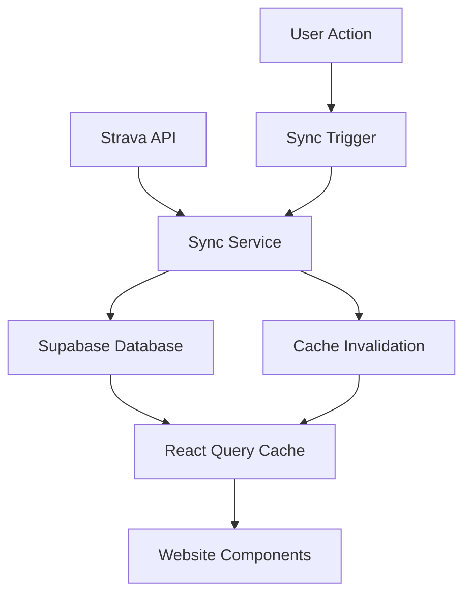

# Data Flow Architecture: From Strava API to Website Display

## Overview

This document provides a comprehensive explanation of how data flows through your EnduroRevamp application, from initial Strava API fetching to database storage to website display. The system uses a **database-first architecture** with intelligent caching and sync management.

## Table of Contents

- [Architecture Overview](#architecture-overview)
- [Data Sources](#data-sources)
- [API Integration Flow](#api-integration-flow)
- [Database Storage](#database-storage)
- [Website Data Fetching](#website-data-fetching)
- [React Query Caching](#react-query-caching)
- [Sync Management](#sync-management)
- [Performance Optimizations](#performance-optimizations)
- [Error Handling](#error-handling)

---

## Architecture Overview

### High-Level Data Flow



### Key Principles

1. **Database-First**: All data is stored in Supabase database
2. **Smart Caching**: React Query manages client-side caching
3. **Incremental Sync**: Only fetch new/updated data
4. **Rate Limit Management**: Respect Strava API limits
5. **Real-time Updates**: Cache invalidation on sync completion

---

## Data Sources

### Primary Data Sources

| Source | Purpose | Frequency | Rate Limits |
|--------|---------|-----------|-------------|
| **Strava API** | Activity data, athlete profile | On-demand sync | 600 requests/day |
| **Supabase Database** | Stored activities, user data | Real-time queries | None |
| **React Query Cache** | Client-side caching | Automatic | None |

### Data Types Stored

#### Activities Table (37 fields)
```typescript
interface Activity {
  // Core identification
  id: string                    // UUID
  user_id: string              // UUID
  strava_activity_id: number   // Strava's ID
  
  // Basic activity info
  name: string                 // Activity name
  sport_type: string           // "Run", "Ride", etc.
  start_date: string           // ISO timestamp
  distance: number             // Meters
  moving_time: number          // Seconds
  
  // Performance metrics
  average_speed: number        // m/s
  average_heartrate: number    // BPM
  average_watts: number        // Watts (cycling)
  
  // Computed fields
  training_stress_score: number // TSS
  average_pace: number         // Seconds per km
  efficiency_score: number     // Performance metric
  
  // Zone data (JSON)
  power_zones: object          // Power zone distribution
  heart_rate_zones: object     // HR zone data
  pace_zones: object          // Pace zone info
}
```

#### Sync State Table
```typescript
interface SyncState {
  user_id: string
  last_activity_sync: string   // Last sync timestamp
  total_activities_synced: number
  sync_requests_today: number  // Rate limit tracking
  sync_enabled: boolean
  consecutive_errors: number
  last_error_message: string
}
```

#### Strava Tokens Table
```typescript
interface StravaTokens {
  user_id: string
  access_token: string
  refresh_token: string
  expires_at: string
  strava_athlete_id: number
  athlete_firstname: string
  athlete_lastname: string
}
```

---

## API Integration Flow

### 1. OAuth Authentication

**Flow**: User → Strava OAuth → Store Tokens

```typescript
// OAuth callback handling
// app/auth/callback/route.ts
export async function GET(request: Request) {
  const { searchParams } = new URL(request.url)
  const code = searchParams.get('code')
  
  // Exchange code for tokens
  const tokens = await exchangeCodeForTokens(code)
  
  // Store tokens in database
  await supabase
    .from('strava_tokens')
    .upsert({
      user_id: userId,
      access_token: tokens.access_token,
      refresh_token: tokens.refresh_token,
      expires_at: tokens.expires_at,
      // ... other fields
    })
}
```

### 2. Token Management

**Automatic Refresh**: Tokens are refreshed before expiration

```typescript
// lib/strava/auth.ts
export class StravaAuth {
  async getValidAccessToken(userId: string): Promise<string | null> {
    const tokens = await this.getTokens(userId)
    
    // Check if token needs refresh
    const now = Math.floor(Date.now() / 1000)
    if (tokens.expires_at <= now) {
      await this.refreshToken(userId, tokens.refresh_token)
      return this.getValidAccessToken(userId) // Recursive call
    }
    
    return tokens.access_token
  }
}
```

### 3. Activity Sync Process

**Main Sync Function**: `lib/strava/sync-activities.ts`

```typescript
export async function syncStravaActivities(options: SyncOptions): Promise<SyncResult> {
  const { userId, forceRefresh = false, maxActivities = 200 } = options
  
  // 1. Get user's Strava tokens
  const tokens = await getStravaTokens(userId)
  
  // 2. Check if token needs refresh
  if (tokens.expires_at <= now || forceRefresh) {
    await refreshStravaToken(userId, tokens.refresh_token)
  }
  
  // 3. Fetch activities from Strava API
  const activities = await fetchStravaActivities(tokens.access_token, maxActivities)
  
  // 4. Sync activities to database
  const syncResult = await syncActivitiesToDatabase(userId, activities)
  
  // 5. Update sync state
  await updateSyncState(userId, syncResult)
  
  return syncResult
}
```

### 4. Strava API Calls

**Activity Fetching**: Direct API calls to Strava

```typescript
async function fetchStravaActivities(accessToken: string, maxActivities: number): Promise<StravaActivity[] | null> {
  const response = await fetch(
    `https://www.strava.com/api/v3/athlete/activities?per_page=${maxActivities}`,
    {
      headers: {
        'Authorization': `Bearer ${accessToken}`,
      },
    }
  )
  
  if (!response.ok) {
    throw new Error(`Failed to fetch activities: ${response.statusText}`)
  }
  
  return await response.json()
}
```

---

## Database Storage

### 1. Activity Processing

**Data Transformation**: Raw Strava data → Database format

```typescript
async function syncActivitiesToDatabase(userId: string, activities: StravaActivity[]): Promise<SyncResult> {
  const supabase = await createClient()
  let newActivities = 0
  let updatedActivities = 0
  
  // Initialize training load calculator for TSS calculations
  const trainingLoadCalculator = new TrainingLoadCalculator(defaultThresholds)
  
  for (const activity of activities) {
    // Calculate TSS for this activity
    const tss = trainingLoadCalculator.calculateTSS(activity as Activity)
    
    const activityData = {
      user_id: userId,
      strava_activity_id: activity.id,
      name: activity.name,
      distance: safeNumber(activity.distance, 0),
      moving_time: safeNumber(activity.moving_time, 0),
      // ... all other fields
      training_stress_score: tss,
      // Computed fields
      week_number: getWeekNumber(new Date(activity.start_date)),
      month_number: new Date(activity.start_date).getMonth() + 1,
      average_pace: activity.moving_time && activity.distance ? 
        (activity.moving_time / (activity.distance / 1000)) : null,
      // ... other computed fields
    }
    
    // Check if activity already exists
    const existingActivity = await supabase
      .from('activities')
      .select('id')
      .eq('user_id', userId)
      .eq('strava_activity_id', activity.id)
      .maybeSingle()
    
    if (existingActivity) {
      // Update existing activity
      await supabase
        .from('activities')
        .update(activityData)
        .eq('id', existingActivity.id)
      updatedActivities++
    } else {
      // Insert new activity
      await supabase
        .from('activities')
        .insert({
          ...activityData,
          created_at: new Date().toISOString(),
        })
      newActivities++
    }
  }
  
  return { newActivities, updatedActivities }
}
```

### 2. Database Schema

**Activities Table**: Stores all activity data with computed fields

```sql
CREATE TABLE activities (
  -- Primary identifiers
  id TEXT PRIMARY KEY,                    -- UUID format
  user_id TEXT NOT NULL,                  -- UUID format
  strava_activity_id INTEGER UNIQUE,     -- Strava's activity ID
  
  -- Basic activity info
  name TEXT,                              -- Activity name
  sport_type TEXT,                        -- "Run", "Ride", etc.
  start_date TEXT,                        -- ISO timestamp
  
  -- Distance and time metrics
  distance NUMERIC,                       -- Meters
  moving_time INTEGER,                    -- Seconds
  elapsed_time INTEGER,                   -- Seconds
  
  -- Performance metrics
  average_speed NUMERIC,                  -- m/s
  average_heartrate INTEGER,             -- BPM
  average_watts INTEGER,                 -- Watts
  
  -- Training metrics (calculated)
  training_stress_score DOUBLE PRECISION, -- TSS
  intensity_score DOUBLE PRECISION,      -- Workout intensity
  recovery_time INTEGER,                 -- Hours needed
  
  -- Computed fields
  week_number INTEGER,                   -- Week of year
  month_number INTEGER,                  -- Month
  average_pace NUMERIC,                  -- Seconds per km
  efficiency_score NUMERIC,              -- Performance metric
  
  -- Zone data (JSON)
  power_zones JSONB,                     -- Power zone distribution
  heart_rate_zones JSONB,                -- HR zone data
  pace_zones JSONB                       -- Pace zone info
);
```

### 3. Data Integrity

**Unique Constraints**: Prevents duplicate activities per user

```sql
-- Composite unique constraint
ALTER TABLE activities 
ADD CONSTRAINT activities_user_strava_activity_unique 
UNIQUE (user_id, strava_activity_id);
```

**Row Level Security**: Users can only access their own data

```sql
-- RLS policies
CREATE POLICY "Users can view own activities" ON activities
  FOR SELECT USING (auth.uid() = user_id);

CREATE POLICY "Users can insert own activities" ON activities
  FOR INSERT WITH CHECK (auth.uid() = user_id);
```

---

## Website Data Fetching

### 1. React Query Setup

**Provider Configuration**: `providers/query.tsx`

```typescript
export function QueryProvider({ children }: { children: React.ReactNode }) {
  const [queryClient] = useState(() => new QueryClient({
    defaultOptions: {
      queries: {
        staleTime: 5 * 60 * 1000, // 5 minutes
        retry: 1,
      },
    },
  }))
  
  return (
    <QueryClientProvider client={queryClient}>
      {children}
      <ReactQueryDevtools initialIsOpen={false} />
    </QueryClientProvider>
  )
}
```

### 2. Activity Data Hook

**Primary Hook**: `hooks/use-user-activities.ts`

```typescript
export function useUserActivities(userId: string) {
  return useQuery({
    queryKey: ['user', 'activities', userId],
    queryFn: async (): Promise<Activity[]> => {
      const supabase = createClient()
      
      const { data, error } = await supabase
        .from('activities')
        .select('*')
        .eq('user_id', userId)
        .order('start_date', { ascending: false })
        .limit(500)

      if (error) {
        throw new Error(`Failed to fetch activities: ${error.message}`)
      }

      return data || []
    },
    enabled: !!userId,
    staleTime: 2 * 60 * 1000, // 2 minutes
    gcTime: 10 * 60 * 1000,   // 10 minutes
    retry: 2,
    refetchOnWindowFocus: true,
    refetchOnReconnect: true,
  })
}
```

### 3. Training Load Hook

**Complex Data Processing**: `hooks/useTrainingLoad.ts`

```typescript
export function useTrainingLoad(userId: string, options: UseTrainingLoadOptions = {}) {
  const { days = 90, enableCalculations = true } = options
  
  // Get activities from database
  const { data: activities = [], isLoading: activitiesLoading } = useUserActivities(userId)

  // Process training load data
  const { data: trainingLoadData, isLoading: processingLoading } = useQuery({
    queryKey: ['training-load', userId, days, activities.length],
    queryFn: () => processTrainingLoadData(activities, days),
    enabled: enableCalculations && activities.length > 0,
    staleTime: 5 * 60 * 1000, // 5 minutes
    gcTime: 30 * 60 * 1000,   // 30 minutes
  })

  return {
    data: trainingLoadData,
    isLoading: activitiesLoading || processingLoading,
    hasData: trainingLoadData && trainingLoadData.totalActivities > 0,
    hasHRData: trainingLoadData && trainingLoadData.activitiesWithHR > 0,
    hasPowerData: trainingLoadData && trainingLoadData.activitiesWithPower > 0,
  }
}
```

### 4. Sync Management Hook

**Sync Operations**: `hooks/use-strava-sync.ts`

```typescript
export function useStravaSync() {
  const queryClient = useQueryClient()

  // Query for sync status
  const { data: syncStatus, isLoading: isLoadingStatus } = useQuery({
    queryKey: ['strava', 'sync-status'],
    queryFn: getSyncStatus,
    staleTime: 5 * 60 * 1000, // 5 minutes
    gcTime: 30 * 60 * 1000,   // 30 minutes
  })

  // Mutation for triggering sync
  const { mutate: triggerSyncMutation, isPending: isSyncing } = useMutation({
    mutationFn: triggerSync,
    onSuccess: (data) => {
      // Invalidate related queries for UI updates
      queryClient.invalidateQueries({ queryKey: ['strava', 'sync-status'] })
      queryClient.invalidateQueries({ queryKey: ['user', 'activities'] })
      queryClient.invalidateQueries({ queryKey: ['training', 'load'] })
      queryClient.invalidateQueries({ queryKey: ['dashboard'] })
    },
  })

  // Helper functions for different sync strategies
  const syncLatest = () => triggerSyncMutation({ maxActivities: 50 })
  const syncLastWeek = () => triggerSyncMutation({ maxActivities: 100 })
  const syncLastMonth = () => triggerSyncMutation({ maxActivities: 200 })

  return {
    syncStatus,
    isLoadingStatus,
    isSyncing,
    syncLatest,
    syncLastWeek,
    syncLastMonth,
  }
}
```

---

## React Query Caching

### 1. Query Key Strategy

**Organized Keys**: Centralized query key management

```typescript
// lib/constants/query-keys.ts
export const QUERY_KEYS = {
  // User data
  user: {
    activities: (userId: string) => ['user', 'activities', userId],
    profile: (userId: string) => ['user', 'profile', userId],
  },

  // Strava integration
  strava: {
    connection: (userId?: string) => ['strava-connection', userId],
    token: (userId?: string) => ['strava-token', userId],
    sync: {
      status: 'strava-sync-status',
      activities: 'strava-activities',
    },
  },

  // Training data
  training: {
    load: (userId: string) => ['training', 'load', userId],
    zones: (userId: string) => ['zone-analysis', userId],
  },

  // Dashboard
  dashboard: {
    keyMetrics: (userId: string) => ['dashboard', 'key-metrics', userId],
    lastActivity: (userId: string) => ['dashboard', 'last-activity', userId],
  },
}
```

### 2. Cache Invalidation

**Smart Invalidation**: Only invalidate related queries

```typescript
// When sync completes, invalidate related queries
const onSyncSuccess = (data) => {
  // Invalidate Strava-related queries
  queryClient.invalidateQueries({ queryKey: ['strava', 'sync-status'] })
  queryClient.invalidateQueries({ queryKey: ['strava', 'activities'] })
  
  // Invalidate database-based queries
  queryClient.invalidateQueries({ queryKey: ['user', 'activities'] })
  queryClient.invalidateQueries({ queryKey: ['training', 'load'] })
  queryClient.invalidateQueries({ queryKey: ['dashboard'] })
}
```

### 3. Stale Time Configuration

**Optimized Freshness**: Balance between freshness and performance

```typescript
// Different stale times for different data types
const STALE_TIMES = {
  activities: 2 * 60 * 1000,      // 2 minutes (frequently updated)
  trainingLoad: 5 * 60 * 1000,    // 5 minutes (computationally expensive)
  syncStatus: 5 * 60 * 1000,      // 5 minutes (rarely changes)
  athleteProfile: 15 * 60 * 1000, // 15 minutes (rarely changes)
  trainingZones: 60 * 60 * 1000,  // 1 hour (very stable)
}
```

---

## Sync Management

### 1. Sync API Route

**Main Endpoint**: `app/api/strava/sync/route.ts`

```typescript
export async function POST(request: NextRequest) {
  try {
    const supabase = await createClient()
    
    // Get authenticated user
    const { data: { user }, error: authError } = await supabase.auth.getUser()
    if (authError || !user) {
      return NextResponse.json({ error: 'Unauthorized' }, { status: 401 })
    }

    const { action, ...options } = await request.json()

    if (action === 'update-tss') {
      // Update existing activities with TSS calculations
      const result = await updateActivitiesWithTSS(user.id)
      return NextResponse.json({ success: true, action: 'update-tss', ...result })
    }

    // Default action: sync activities
    const result = await syncStravaActivities({
      userId: user.id,
      ...options
    })

    return NextResponse.json(result)
  } catch (error) {
    console.error('Sync API error:', error)
    return NextResponse.json({ error: 'Internal server error' }, { status: 500 })
  }
}
```

### 2. Rate Limit Management

**Smart Rate Limiting**: Prevent API abuse

```typescript
async function checkCanSync(userId: string, syncState: SyncState | null): Promise<boolean> {
  if (!syncState) return true // First time sync

  if (!syncState.sync_enabled) return false

  // Check daily rate limit (5 syncs per day)
  if ((syncState.sync_requests_today || 0) >= 5) {
    console.log('❌ Daily rate limit exceeded:', syncState.sync_requests_today)
    return false
  }

  // Check minimum time between syncs (1 hour)
  if (syncState.last_activity_sync) {
    const lastSync = new Date(syncState.last_activity_sync)
    const oneHourAgo = new Date(Date.now() - 60 * 60 * 1000)
    
    if (lastSync > oneHourAgo) {
      console.log('❌ Too soon since last sync (1 hour cooldown)')
      return false
    }
  }

  return true
}
```

### 3. Sync State Tracking

**State Management**: Track sync history and limits

```typescript
// Update sync state after successful sync
const updateSyncState = async (userId: string, syncResult: SyncResult) => {
  const today = new Date().toDateString()
  
  await supabase
    .from('sync_state')
    .upsert({
      user_id: userId,
      last_activity_sync: new Date().toISOString(),
      last_sync_date: today,
      sync_requests_today: 1, // Will be incremented by existing logic
      total_activities_synced: (syncResult.newActivities + syncResult.updatedActivities),
      sync_enabled: true,
      consecutive_errors: 0,
      last_error_message: null,
      last_error_at: null,
      updated_at: new Date().toISOString()
    })
}
```

---

## Performance Optimizations

### 1. Database Optimizations

**Indexes**: Fast queries on frequently accessed fields

```sql
-- Indexes for performance
CREATE INDEX idx_activities_user_date ON activities(user_id, start_date DESC);
CREATE INDEX idx_activities_sport_type ON activities(user_id, sport_type);
CREATE INDEX idx_activities_has_hr ON activities(user_id, has_heartrate);
CREATE INDEX idx_activities_has_power ON activities(user_id, has_power);
```

**Query Optimization**: Efficient data retrieval

```typescript
// Optimized activity query
const { data, error } = await supabase
  .from('activities')
  .select('*')
  .eq('user_id', userId)
  .order('start_date', { ascending: false })
  .limit(500) // Reasonable limit for performance
```

### 2. React Query Optimizations

**Stale Time Configuration**: Reduce unnecessary refetches

```typescript
// Optimized stale times
const OPTIMIZED_STALE_TIMES = {
  activities: 2 * 60 * 1000,      // 2 minutes (frequently updated)
  trainingLoad: 5 * 60 * 1000,    // 5 minutes (computationally expensive)
  syncStatus: 5 * 60 * 1000,      // 5 minutes (rarely changes)
  athleteProfile: 15 * 60 * 1000, // 15 minutes (rarely changes)
}
```

**Garbage Collection**: Automatic cache cleanup

```typescript
// Optimized garbage collection times
const OPTIMIZED_GC_TIMES = {
  activities: 10 * 60 * 1000,     // 10 minutes
  trainingLoad: 30 * 60 * 1000,   // 30 minutes
  syncStatus: 30 * 60 * 1000,     // 30 minutes
  athleteProfile: 60 * 60 * 1000, // 1 hour
}
```

### 3. Component Optimizations

**Selective Re-rendering**: Only re-render when data changes

```typescript
// Optimized component with selective updates
export function ActivityFeed({ userId }: { userId: string }) {
  const { data: activities, isLoading } = useUserActivities(userId)
  
  // Only re-render when activities change
  const recentActivities = useMemo(() => 
    activities?.slice(0, 5) || [], 
    [activities]
  )
  
  if (isLoading) return <ActivityFeedSkeleton />
  
  return (
    <div>
      {recentActivities.map(activity => (
        <ActivityCard key={activity.id} activity={activity} />
      ))}
    </div>
  )
}
```

---

## Error Handling

### 1. API Error Handling

**Graceful Degradation**: Handle API failures gracefully

```typescript
// Strava API error handling
async function fetchStravaActivities(accessToken: string, maxActivities: number) {
  try {
    const response = await fetch(
      `https://www.strava.com/api/v3/athlete/activities?per_page=${maxActivities}`,
      {
        headers: { 'Authorization': `Bearer ${accessToken}` },
      }
    )

    if (!response.ok) {
      if (response.status === 401) {
        throw new Error('Token expired - refresh required')
      }
      if (response.status === 429) {
        throw new Error('Rate limit exceeded - try again later')
      }
      throw new Error(`Strava API error: ${response.statusText}`)
    }

    return await response.json()
  } catch (error) {
    console.error('Error fetching Strava activities:', error)
    return null
  }
}
```

### 2. Database Error Handling

**Transaction Safety**: Ensure data consistency

```typescript
// Database error handling with rollback
async function syncActivitiesToDatabase(userId: string, activities: StravaActivity[]) {
  const supabase = await createClient()
  
  try {
    // Use transaction for data consistency
    const { data, error } = await supabase.rpc('sync_activities_batch', {
      user_id: userId,
      activities_json: JSON.stringify(activities)
    })
    
    if (error) {
      console.error('Database sync error:', error)
      throw new Error(`Database sync failed: ${error.message}`)
    }
    
    return data
  } catch (error) {
    console.error('Sync to database failed:', error)
    throw error
  }
}
```

### 3. React Query Error Handling

**Retry Logic**: Automatic retry with exponential backoff

```typescript
// Optimized retry configuration
const RETRY_CONFIG = {
  activities: {
    retry: 2,
    retryDelay: (attemptIndex: number) => Math.min(1000 * 2 ** attemptIndex, 30000),
  },
  trainingLoad: {
    retry: 1, // Expensive operation, don't retry too much
    retryDelay: (attemptIndex: number) => Math.min(2000 * 2 ** attemptIndex, 60000),
  },
  syncStatus: {
    retry: false, // Don't retry sync status checks
  },
}
```

---

## Complete Data Flow Example

### Scenario: User Completes a Run

1. **User Activity**: User completes a 5K run in Strava
2. **Sync Trigger**: User clicks "Sync Strava Data" in your app
3. **API Call**: App calls `/api/strava/sync` with user's access token
4. **Token Validation**: System checks if token is valid, refreshes if needed
5. **Strava API**: Fetches latest activities from Strava API
6. **Data Processing**: Calculates TSS, training load, and other metrics
7. **Database Storage**: Stores processed activity in Supabase database
8. **Cache Invalidation**: React Query invalidates related caches
9. **UI Update**: All components automatically update with new data
10. **User Experience**: User sees their new run in dashboard, training load, etc.

### Performance Metrics

- **API Response Time**: ~200-500ms per Strava API call
- **Database Query Time**: ~50-100ms for activity queries
- **Cache Hit Time**: ~1-5ms for cached data
- **UI Update Time**: ~10-50ms for React re-renders
- **Total Sync Time**: ~2-5 seconds for 200 activities

---

## Best Practices

### 1. Data Consistency

- **Single Source of Truth**: Database is the authoritative data source
- **Cache Invalidation**: Always invalidate related caches after sync
- **Transaction Safety**: Use database transactions for data consistency

### 2. Performance

- **Selective Queries**: Only fetch data you need
- **Optimized Indexes**: Database indexes on frequently queried fields
- **Smart Caching**: Appropriate stale times for different data types

### 3. Error Resilience

- **Graceful Degradation**: App works even when some data is unavailable
- **Retry Logic**: Automatic retry for transient failures
- **User Feedback**: Clear error messages and loading states

### 4. Rate Limit Management

- **Smart Sync**: Only sync when necessary
- **Rate Limit Tracking**: Track API usage to prevent limits
- **Backoff Strategy**: Exponential backoff for failed requests

---

*This document provides a comprehensive overview of your data flow architecture. The system is designed for performance, reliability, and user experience, with intelligent caching, error handling, and rate limit management.* 