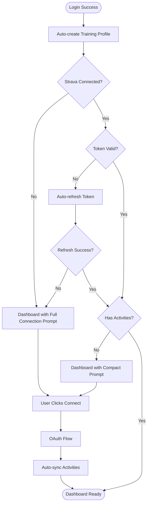

# MVP Post-Login Flow Improvements

**Date:** December 18, 2025  
**Status:** ✅ Completed

## Overview

Implemented 4 key improvements to streamline the post-login user experience for MVP:

## Changes Implemented

### 1. ✅ Token Validation on Dashboard Mount

**File:** `components/dashboard/StravaOAuthHandler.tsx`

**What Changed:**
- Added automatic token validation when dashboard loads
- Non-blocking check that validates Strava tokens in background
- Prevents silent failures when tokens are expired

**Benefits:**
- Catches token expiration issues early
- Logs validation status for debugging
- Doesn't block user experience if check fails

---

### 2. ✅ Profile Auto-Creation Trigger

**File:** `supabase/migrations/20250118_add_profile_auto_creation_trigger.sql`

**What Changed:**
- Created database trigger that auto-creates `user_training_profiles` record on signup
- Sets sensible defaults: intermediate level, 400 TSS target, metric units
- Prevents missing profile errors in middleware and dashboard

**To Apply:**
```bash
# Run this migration in Supabase SQL Editor:
# Copy contents of supabase/migrations/20250118_add_profile_auto_creation_trigger.sql
```

**Benefits:**
- No more missing profile errors
- Users get working dashboard immediately
- Middleware admin checks won't fail

---

### 3. ✅ Better Empty State Messaging

**Files Modified:**
- `components/dashboard/TrainingReadinessCard.tsx`
- `components/dashboard/WeeklyTrainingLoadWidget.tsx`

**What Changed:**
- Replaced generic "No data" messages with actionable CTAs
- Added "Connect Strava" buttons in empty states
- Improved visual design with icons and clear messaging

**Before:**
```
No recent activity data available
```

**After:**
```
No Activity Data Yet
Connect Strava to start tracking your training readiness and recovery
[Connect Strava Button]
```

---

### 4. ✅ Simplified Onboarding - Dashboard CTA

**New Files:**
- `components/dashboard/StravaConnectionPrompt.tsx` - Reusable Strava connection prompt
- `components/dashboard/DashboardStravaPrompt.tsx` - Smart component that shows prompt when needed

**Files Modified:**
- `app/dashboard/page.tsx` - Added prominent connection prompt

**What Changed:**
- Created beautiful, full-width Strava connection prompt
- Shows automatically when user has no Strava connection
- Two variants:
  - **Full:** Large hero prompt with features grid (no connection)
  - **Compact:** Inline banner (connected but no activities)

**Features of the Prompt:**
- 🎨 Gradient design with orange Strava branding
- 📊 Shows 3 key benefits: Auto Sync, Training Insights, Progress Tracking
- 🔒 Privacy reassurance message
- 🚀 One-click OAuth connection

---

## User Flow Diagram (Updated)



## What Was Removed/Simplified

### ❌ No Longer Needed:
- Multi-step onboarding modal (was complex, slowed time-to-value)
- Explicit "goals selection" step before Strava (goals can be added later)
- Polling UI for sync status (sync is fire-and-forget)
- "Mark User Ready" step (no database flag needed)

### ✅ What Remains:
- Simple, prominent Strava connection CTA on dashboard
- Automatic token refresh during operations
- Non-blocking initial sync after OAuth
- Clear empty states with actionable next steps

---

## Testing Checklist

### For New Users (No Strava):
- [ ] Sign up → Training profile auto-created
- [ ] Land on dashboard → See full Strava connection prompt
- [ ] Click "Connect Strava" → OAuth flow works
- [ ] After OAuth → Activities sync automatically
- [ ] Dashboard shows data after sync

### For Existing Users (With Strava):
- [ ] Login → Token validated on mount
- [ ] Expired token → Auto-refreshes silently
- [ ] No activities → Compact prompt shows
- [ ] Has activities → Full dashboard with insights

### For Edge Cases:
- [ ] Token refresh failure → Clear error message
- [ ] Sync failure → Non-blocking, user sees dashboard
- [ ] Slow network → Loading states show properly
- [ ] Multiple OAuth attempts → No race conditions

---

## Migration Steps

### 1. Apply Database Migration
```bash
# In Supabase SQL Editor, run:
# supabase/migrations/20250118_add_profile_auto_creation_trigger.sql
```

### 2. Test New User Flow
```bash
# 1. Create test account
# 2. Verify profile auto-creation
# 3. Test Strava connection from dashboard prompt
```

### 3. Deploy Frontend Changes
```bash
# All component changes are backward compatible
npm run build
npm run deploy
```

---

## Metrics to Monitor

### Key Success Indicators:
1. **Time to First Connection:** How long from signup to Strava connected
2. **Connection Rate:** % of users who connect Strava within first session
3. **Sync Success Rate:** % of connections that successfully sync activities
4. **Empty State Engagement:** Click-through rate on "Connect Strava" CTAs

### Error Monitoring:
- Token validation failures
- Profile creation errors (should be zero now)
- OAuth callback errors
- Sync failures (should be non-blocking)

---

## Future Enhancements (Post-MVP)

### Could Add Later:
- [ ] Progress bar during initial sync
- [ ] Email reminder if user hasn't connected after 24h
- [ ] Manual activity entry as alternative to Strava
- [ ] "How it works" video/tutorial in connection prompt
- [ ] Social proof: "Join 10,000+ athletes using this app"

### Advanced Features:
- [ ] Multi-source sync (Garmin, Apple Health, etc.)
- [ ] Offline mode with manual entry
- [ ] Training plan recommendations during onboarding
- [ ] Goal templates: "I want to run a 5K"

---

## Summary

**Before:**
- Complex multi-step onboarding modal
- Missing profile errors
- Generic empty states
- Unclear what to do next

**After:**
- Clean, simple dashboard-first approach
- Automatic profile creation
- Clear, actionable empty states
- Prominent, beautiful connection prompt
- Faster time-to-value

**Result:** MVP-ready flow that gets users to insights faster with less confusion! 🚀
