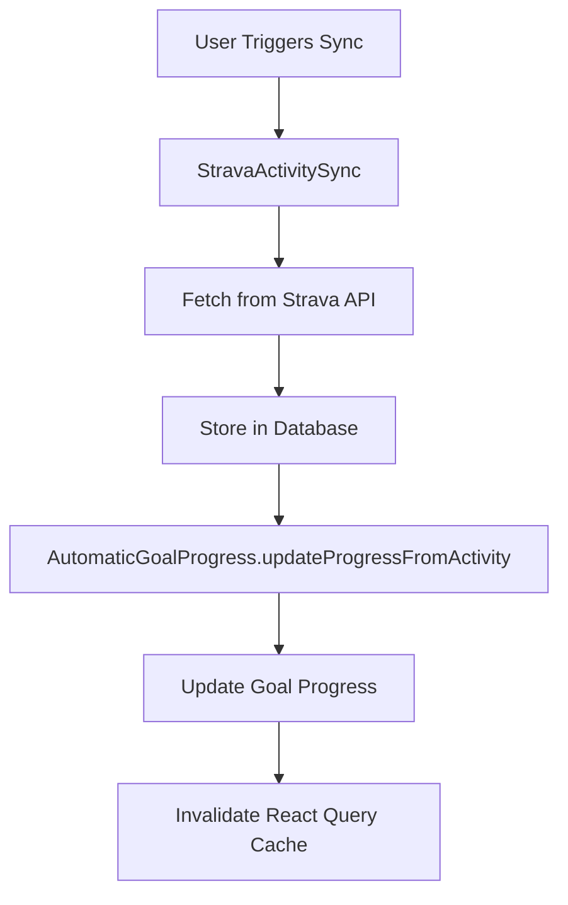

# Strava Integration Setup Guide

## Overview

This guide will help you set up the foundation for Strava data ingestion with smart duplicate prevention and efficient syncing.

## 1. Database Setup

### Step 1: Run the Migration in Supabase

1. Go to your Supabase dashboard
2. Navigate to **SQL Editor**
3. Create a new query and paste the contents of `supabase/migrations/001_create_strava_tables.sql`
4. Run the migration

This creates:
- `athlete_profiles` table for Strava user data
- `activities` table for workout data
- `sync_state` table for tracking sync status
- Proper indexes and security policies

### Step 2: Verify Tables

Check that these tables were created:
```sql
-- Verify tables exist
SELECT table_name FROM information_schema.tables 
WHERE table_schema = 'public' 
AND table_name IN ('athlete_profiles', 'activities', 'sync_state');
```

## 2. Smart Sync Features

### Duplicate Prevention
- **Unique Constraints**: Activities are stored with `strava_activity_id` as unique key
- **Upsert Logic**: Updates only when data has actually changed
- **Time-based Updates**: Only updates activities older than 24 hours (for social metrics)
- **Profile Diffing**: Compares profile fields to avoid unnecessary writes

### Rate Limit Management
- **Intelligent Timing**: Won't sync more than once per hour unless forced
- **Incremental Sync**: Uses timestamps to only fetch new/updated data
- **Error Tracking**: Records sync failures and implements backoff

### Data Integrity
- **Conflict Resolution**: Handles Strava ID conflicts gracefully
- **Rollback Support**: Database transactions ensure consistency
- **User Isolation**: RLS policies ensure users only see their own data

### Automatic Goal Progress Integration
- **Real-time Updates**: Goal progress updates automatically after each activity sync
- **Non-blocking**: Goal updates don't fail the sync if they encounter errors
- **Comprehensive Tracking**: Supports distance, pace, frequency, time, and elevation goals

## 3. Usage Examples

### Basic Sync
```typescript
import { useStravaSync } from '@/hooks/strava/useStravaSync';

function MyComponent() {
  const { syncLatest, isSyncing } = useStravaSync();
  
  return (
    <button onClick={syncLatest} disabled={isSyncing}>
      Sync Activities
    </button>
  );
}
```

### Advanced Sync with Options
```typescript
import { StravaActivitySync } from '@/lib/strava/sync-activities';

const syncService = new StravaActivitySync(userId);
const result = await syncService.syncUserActivities({
  maxActivities: 100,
  sinceDays: 7,
  forceRefresh: false
});
```

## 4. Architecture Overview

### Current Implementation


### Key Components
- **`StravaActivitySync`**: Main sync service (currently used)
- **`AutomaticGoalProgress`**: Goal progress integration
- **`useStravaSync`**: React hook for sync operations
- **`/api/strava/sync`**: API endpoint for sync operations

## 5. Testing

### Manual Testing
1. Go to `/test-sync` in your app
2. Run the sync tests to verify functionality
3. Check that activities appear in the database
4. Verify goal progress updates automatically

### Automated Testing
```bash
# Run sync-related tests
npm test -- --testPathPattern=sync

# Run specific test files
npm test -- --testPathPattern=sync-activities
npm test -- --testPathPattern=sync-goal-progress-integration
```

## 6. Troubleshooting

### Common Issues
1. **Rate Limit Exceeded**: Wait 1 hour between syncs
2. **Token Expired**: Refresh Strava connection
3. **Goal Progress Not Updating**: Check database function `update_goal_progress_from_activity`

### Debug Tools
- Use `SyncDebugger` component for detailed sync analysis
- Check `sync_state` table for sync history
- Monitor console logs for sync progress

## 7. Best Practices

1. **Sync Frequency**: Limit to once per hour unless forced
2. **Error Handling**: Always handle sync failures gracefully
3. **Cache Management**: Invalidate related queries after sync
4. **Goal Integration**: Goal progress updates are non-blocking
5. **Data Consistency**: Use database as source of truth for analytics

---

*This setup provides a robust, scalable foundation for Strava integration with automatic goal tracking.* 