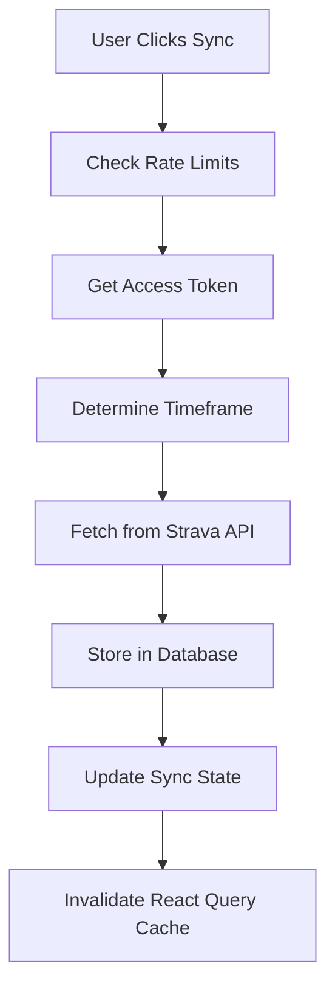

# Strava Sync Process & Best Practices

## Understanding Your Current Architecture

Your app uses a **hybrid approach** with two data sources:

### 🔄 Data Sources

| Component Type | Data Source | Hook Used | Pros | Cons |
|---|---|---|---|---|
| **Analytics/Feed** | Strava API Direct | `useAthleteActivities` | Real-time, always current | Rate limited, slower, API dependent |
| **Dashboard/Metrics** | Database | `useUserActivities` | Fast, reliable, complex queries | Requires sync, may be stale |

### 🏗️ Current Sync Flow



## Getting New Activities Into Database

### ✅ For Your New Run

1. **Immediate Action**: Click "Sync Strava Data" button in dashboard
2. **What Happens**: 
   - Fetches activities since last sync (with 1-hour buffer)
   - Upserts new activities into database
   - Updates components using database data

### 🎯 Sync Strategies Available

```typescript
// Different sync options in your app:
syncLatest()        // Last 50 activities
syncLastWeek()      // Last 7 days, max 100 activities  
syncLastMonth()     // Last 30 days, max 200 activities
forceFullSync()     // Last 3 months, forced refresh
```

## Current Limitations & Issues

### ⚠️ Problems to Address

1. **Inconsistent Data Sources**
   - Some components show real-time API data
   - Others show potentially stale database data
   - Users see different data in different parts of the app

2. **Manual Sync Only**
   - No automatic background sync
   - Users must remember to sync
   - New activities don't appear until manual sync

3. **Rate Limiting Constraints**
   - 5 syncs per day maximum
   - 1 hour cooldown between syncs
   - Can miss activities if not syncing regularly

4. **Sync Race Conditions**
   - Multiple components might trigger sync
   - No coordination between sync requests

## Best Practices & Solutions

### 🎯 Recommendation 1: Unified Data Strategy

**Option A: Database-First Approach**
- Store all activities in database via sync
- All components read from database
- Implement background/automatic sync

**Option B: Smart Hybrid Approach**
- Recent data (last 7 days): API direct
- Historical data: Database
- Clear UX indicating data source

### 🤖 Recommendation 2: Automatic Sync

```typescript
// Implement webhook-based sync
POST /api/webhooks/strava
// Or scheduled background sync
// Or smart sync on app focus
```

### 📊 Recommendation 3: Better Sync UX

```typescript
// Show sync status clearly
interface SyncStatus {
  lastSync: Date
  dataFreshness: 'realtime' | 'stale' | 'syncing'
  nextSyncAvailable: Date
  pendingActivities: number
}
```

### 🔄 Recommendation 4: Incremental Sync Strategy

```typescript
// Optimize sync frequency
const syncStrategy = {
  // Frequent small syncs for recent data
  recent: { since: '24h', frequency: 'hourly' },
  
  // Less frequent larger syncs for historical
  historical: { since: '30d', frequency: 'daily' },
  
  // Full refresh occasionally
  full: { since: '3m', frequency: 'weekly' }
}
```

## Handling Sync Issues

### 🔍 Common Issues & Solutions

**Issue: Database doesn't match API**
```typescript
// Solution: Force refresh sync
forceFullSync() // Re-syncs last 3 months
```

**Issue: Missing recent activities**
```typescript
// Solution: Reduce sync timeframe buffer
const since = lastSync - (2 * 60 * 60 * 1000) // 2-hour buffer instead of 1
```

**Issue: Rate limit exceeded**
```typescript
// Solution: Implement smart sync timing
const canSync = syncStatus.canSync && !recentSync()
```

**Issue: Failed sync doesn't retry**
```typescript
// Solution: Implement retry logic with exponential backoff
const retrySync = async (attempts = 3) => {
  // Retry logic here
}
```

### 🛠️ Debugging Sync Issues

1. **Check Sync State**:
   ```sql
   SELECT * FROM sync_state WHERE user_id = 'your-user-id'
   ```

2. **Check Recent Activities**:
   ```sql
   SELECT COUNT(*), MAX(start_date) 
   FROM activities 
   WHERE user_id = 'your-user-id'
   ```

3. **Test API Access**:
   ```typescript
   // Use SyncDebugger component
   <SyncDebugger />
   ```

## Implementation Roadmap

### Phase 1: Fix Current Issues
- [ ] Standardize on single data source per feature
- [ ] Improve sync error handling
- [ ] Add better sync status UI

### Phase 2: Enhance Sync Strategy  
- [ ] Implement automatic sync triggers
- [ ] Add webhook support for real-time updates
- [ ] Optimize sync frequency and timeframes

### Phase 3: Advanced Features
- [ ] Partial sync for specific activity types
- [ ] Conflict resolution for updated activities
- [ ] Offline sync queue

## Quick Actions for Your New Run

### Right Now:
1. Open your dashboard
2. Click "Sync Strava Data" 
3. Wait for sync to complete
4. Your run will appear in database-powered components

### Long Term:
1. Consider implementing automatic sync
2. Standardize data sources across components
3. Add better sync status indicators
4. Set up monitoring for sync health

---

*This guide assumes your current codebase structure. The recommendations can be implemented incrementally without breaking existing functionality.* 