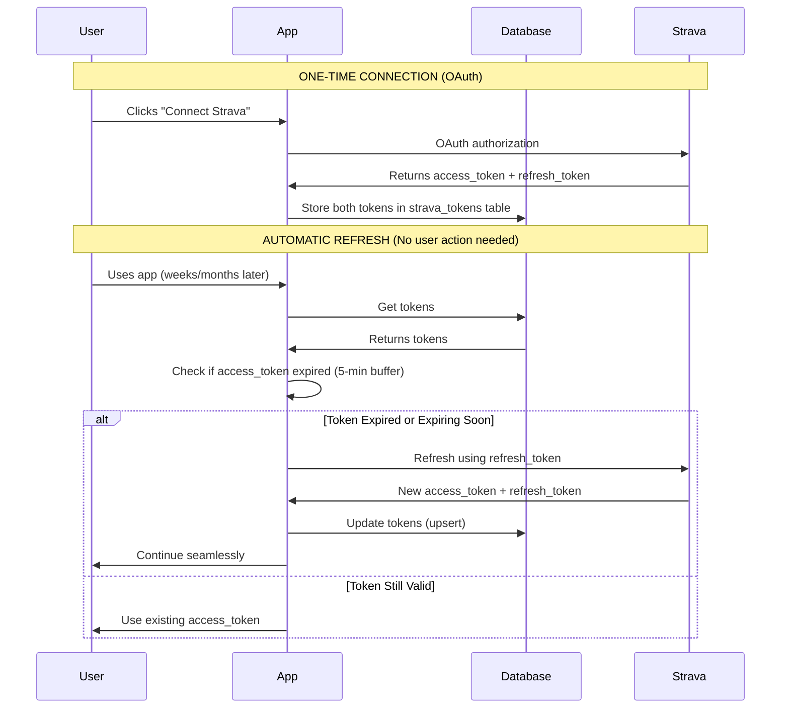

# Strava Token Refresh Flow

## Overview

This application implements a **connect once, refresh automatically** authentication flow for Strava. Users only need to connect their Strava account once, and the tokens will automatically refresh in the background indefinitely.

## How It Works

### One-Time Connection (OAuth)

1. User clicks "Connect Strava" in the app
2. User is redirected to Strava for authorization
3. Strava returns an authorization code
4. App exchanges code for:
   - `access_token` (expires in ~6 hours)
   - `refresh_token` (never expires unless revoked)
5. Both tokens are stored in `strava_tokens` table with `user_id` as unique key

### Automatic Token Refresh (No User Action)

The app automatically checks token expiration and refreshes when needed:



## Key Components

### 1. Database Storage (`strava_tokens` table)

Stores tokens with unique constraint on `user_id`:

```sql
CREATE TABLE strava_tokens (
  user_id UUID PRIMARY KEY,
  access_token TEXT NOT NULL,
  refresh_token TEXT NOT NULL,  -- Never expires!
  expires_at TIMESTAMP NOT NULL,
  strava_athlete_id BIGINT NOT NULL,
  -- ... other fields
);
```

### 2. Automatic Refresh Logic (`lib/strava/auth.ts`)

The `StravaAuth.getValidAccessToken()` method automatically handles expiration:

```typescript
async getValidAccessToken(userId: string): Promise<string | null> {
  const tokens = await this.getTokens(userId);
  if (!tokens) return null;

  const expiresAt = new Date(tokens.expires_at);
  const now = new Date();
  const bufferTime = 5 * 60 * 1000; // 5 minutes buffer

  // Check if token expires within 5 minutes
  if (expiresAt.getTime() <= now.getTime() + bufferTime) {
    // Automatically refresh without user intervention
    const refreshedTokens = await this.refreshTokens(
      tokens.refresh_token,
      userId
    );
    return refreshedTokens?.access_token || tokens.access_token;
  }

  return tokens.access_token;
}
```

**Key Features:**
- 5-minute expiration buffer (proactive refresh)
- Falls back to old token if refresh fails (graceful degradation)
- Returns `null` only if no tokens exist

### 3. Refresh Token Endpoint (`app/api/auth/strava/token/route.ts`)

Manual refresh endpoint (`PUT /api/auth/strava/token`):

```typescript
export async function PUT() {
  // 1. Get current user's tokens from database
  // 2. Call Strava API with refresh_token
  // 3. Update database with new tokens
  // 4. Return success
}
```

Used by:
- Manual token refresh requests
- Client-side refresh operations

### 4. React Query Hook (`hooks/strava/useStravaToken.ts`)

Client-side token management with smart caching:

```typescript
export function useStravaToken() {
  const { user } = useAuth();

  const { data: accessToken, isLoading, error, refetch } = useQuery({
    queryKey: ['strava-token', user?.id],
    queryFn: async () => {
      const stravaAuth = new StravaAuth(false);
      return await stravaAuth.getValidAccessToken(user.id);
    },
    staleTime: 15 * 60 * 1000,  // 15 minutes
    gcTime: 30 * 60 * 1000,      // 30 minutes
  });

  return { accessToken, isLoading, error };
}
```

**Benefits:**
- Caches tokens for 15 minutes (reduces database queries)
- Automatically refetches when stale
- Handles loading and error states

### 5. Token Upsert Pattern

All token updates use upsert to maintain single record per user:

```typescript
await supabase.from('strava_tokens').upsert(
  {
    user_id: userId,
    access_token: authData.access_token,
    refresh_token: authData.refresh_token,
    expires_at: new Date(authData.expires_at * 1000).toISOString(),
    // ... other fields
  },
  {
    onConflict: 'user_id',
    ignoreDuplicates: false,  // Always update
  }
);
```

## Environment Variables

Required for token refresh to work:

```bash
# Client ID (accessible in browser and server)
NEXT_PUBLIC_STRAVA_CLIENT_ID=your_client_id

# Client Secret (server-only, never exposed to browser)
STRAVA_CLIENT_SECRET=your_client_secret

# OAuth redirect URI
NEXT_PUBLIC_STRAVA_REDIRECT_URI=http://localhost:3000/dashboard
```

**Important:** All refresh operations must use `NEXT_PUBLIC_STRAVA_CLIENT_ID` (not `STRAVA_CLIENT_ID`) to ensure the variable is available in all contexts.

## When Users Need to Reconnect

Users only need to reconnect in these rare scenarios:

### ❌ User Manually Revokes Access
If user goes to Strava settings and revokes app access, the `refresh_token` becomes invalid.

**Solution:** User must reconnect via OAuth flow.

### ❌ App Credentials Change
If you change `STRAVA_CLIENT_ID` or `STRAVA_CLIENT_SECRET` in your Strava app settings.

**Solution:** All users must reconnect.

### ❌ Invalid Grant Error
Strava returns `invalid_grant` error (very rare, usually security-related).

**Solution:** App automatically deletes tokens; user must reconnect.

### ✅ Normal Operations (No Reconnection Needed)

- Token expires after 6 hours → Automatically refreshed
- User doesn't use app for months → Tokens still valid
- App restarts/deploys → Tokens persist in database
- Network errors during refresh → Retry with exponential backoff

## Testing Token Refresh

### Manual Test

1. Connect Strava account
2. Wait for `access_token` to expire (6 hours) OR manually set `expires_at` to past date in database
3. Try to fetch Strava data
4. Observe automatic refresh in logs:

```
🔄 Token expiring soon, attempting refresh...
🔄 Refreshing Strava tokens for user: <user_id>
✅ Token refresh successful
```

### Programmatic Test

```typescript
const stravaAuth = new StravaAuth(true);

// Get valid token (will refresh if needed)
const accessToken = await stravaAuth.getValidAccessToken(userId);

if (accessToken) {
  console.log('✅ Token valid and ready to use');
} else {
  console.log('❌ No tokens found, user needs to connect');
}
```

## Error Handling

### Graceful Degradation

The system handles errors gracefully:

1. **Network Errors:** Retries with exponential backoff (2 retries)
2. **Temporary Failures:** Falls back to existing token
3. **Invalid Grant:** Disconnects user, prompts reconnection
4. **Missing Credentials:** Returns clear error message

### Logging

All refresh operations log their status:

```typescript
console.log('🔄 Refreshing Strava tokens for user:', userId);
console.log('✅ Token refresh successful');
console.error('❌ Token refresh failed:', error);
```

## Best Practices

### ✅ DO

- Use `getValidAccessToken()` whenever you need to call Strava API
- Let the system automatically refresh tokens
- Cache tokens client-side with React Query
- Use upsert pattern for token updates
- Log refresh operations for debugging

### ❌ DON'T

- Don't manually check token expiration in your code
- Don't force users to reconnect on every visit
- Don't store tokens in localStorage/sessionStorage
- Don't call Strava API without checking token validity first
- Don't use incorrect environment variable names (use `NEXT_PUBLIC_STRAVA_CLIENT_ID`)

## Architecture Benefits

### Security
- Refresh tokens never exposed to browser
- Tokens stored server-side in Supabase
- Client secret never sent to client

### User Experience
- Seamless authentication (connect once)
- No interruptions for token expiration
- Automatic background refresh

### Reliability
- Proactive refresh (5-minute buffer)
- Graceful error handling
- Retry logic with exponential backoff
- Falls back to existing tokens on failure

### Performance
- Client-side caching (15-min stale time)
- Reduces database queries
- Minimizes Strava API calls

## Related Files

- [`lib/strava/auth.ts`](../lib/strava/auth.ts) - Core authentication logic
- [`lib/strava/sync-activities.ts`](../lib/strava/sync-activities.ts) - Activity sync with token refresh
- [`app/api/auth/strava/token/route.ts`](../app/api/auth/strava/token/route.ts) - Token refresh API endpoint
- [`hooks/strava/useStravaToken.ts`](../hooks/strava/useStravaToken.ts) - React hook for token management
- [`hooks/strava/useStravaConnection.ts`](../hooks/strava/useStravaConnection.ts) - Connection status hook

## Summary

Your Strava authentication is built to **connect once, work forever**:

1. ✅ User connects Strava account once
2. ✅ Tokens stored in database with refresh token
3. ✅ App automatically checks expiration (5-min buffer)
4. ✅ Automatic refresh when needed (transparent to user)
5. ✅ New tokens saved to database
6. ✅ User never needs to reconnect (unless they revoke access)

**Result:** Users have a seamless experience with zero interruptions! 🎉

