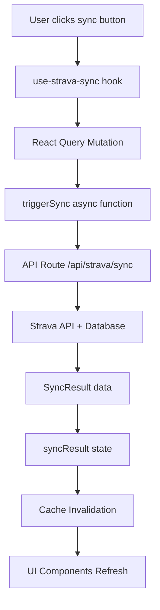

# 🔄 Sync Flow Architecture: From Button Click to UI Update

## Overview

This document explains how data synchronization works in EnduroRevamp, from the moment a user clicks a sync button to when the UI updates with fresh data. The system uses **React Query mutations** as the core mechanism for managing async operations and state.

## Table of Contents

- [Architecture Overview](#architecture-overview)
- [The Heavy Lifter: use-strava-sync Hook](#the-heavy-lifter-use-strava-sync-hook)
- [React Query Mutation Pattern](#react-query-mutation-pattern)
- [Data Flow Step-by-Step](#data-flow-step-by-step)
- [Cache Invalidation Magic](#cache-invalidation-magic)
- [Component Responsibilities](#component-responsibilities)
- [Key Patterns](#key-patterns)

---

## Architecture Overview

### High-Level Flow



### Key Components

| Component | Role | Responsibility |
|-----------|------|----------------|
| **SyncButton/FullSyncButton** | UI Trigger | User interaction |
| **use-strava-sync** | Heavy Lifter | Orchestrates everything |
| **React Query Mutation** | State Manager | Handles async operations |
| **triggerSync** | API Caller | Pure async function |
| **API Route** | Backend Logic | Sync business logic |
| **Cache Invalidation** | UI Updater | Refreshes all components |

---

## The Heavy Lifter: use-strava-sync Hook

### Core Structure

The `use-strava-sync` hook is the **central orchestrator** that combines React Query patterns with business logic:

```typescript
export function useStravaSync() {
  const queryClient = useQueryClient()

  // 1. Query for sync status (read-only)
  const {
    data: syncStatus,
    isLoading: isLoadingStatus,
    refetch: refetchStatus
  } = useQuery({
    queryKey: ['strava', 'sync-status'],
    queryFn: getSyncStatus,
    staleTime: 5 * 60 * 1000,
  })

  // 2. Mutation for sync operations (read-write)
  const {
    mutate: triggerSyncMutation,
    isPending: isSyncing,
    error: syncError,
    data: syncResult  // ← Where returned data lives!
  } = useMutation({
    mutationFn: triggerSync,
    onSuccess: (data) => {
      // Cache invalidation magic
      queryClient.invalidateQueries({ queryKey: ['user', 'activities'] })
      queryClient.invalidateQueries({ queryKey: ['training', 'load'] })
      queryClient.invalidateQueries({ queryKey: ['dashboard'] })
    },
  })

  // 3. Helper functions for different sync strategies
  const quickSync = () => {
    triggerSyncMutation({ syncType: 'quick' })
  }

  const fullSync = () => {
    triggerSyncMutation({ syncType: 'full' })
  }

  return {
    // Status data
    syncStatus,
    isLoadingStatus,
    
    // Sync controls
    quickSync,
    fullSync,
    
    // Mutation state
    isSyncing,
    syncError,
    syncResult,
    
    // Manual controls
    refreshStatus,
  }
}
```

### What Makes It the "Heavy Lifter"

1. **Combines Query + Mutation**: Manages both read (status) and write (sync) operations
2. **State Management**: Provides loading, error, and success states
3. **Cache Coordination**: Handles invalidation across the entire app
4. **Business Logic**: Encapsulates sync strategies and options
5. **UI Integration**: Returns everything components need

---

## React Query Mutation Pattern

### The Power of Mutations

React Query mutations transform simple async functions into powerful, state-managed operations:

```typescript
const {
  mutate: triggerSyncMutation,  // Function to trigger sync
  isPending: isSyncing,         // Loading state
  error: syncError,             // Error state
  data: syncResult              // Success data
} = useMutation({
  mutationFn: triggerSync,      // Your async function
  onSuccess: (data) => {        // Success callback
    // Handle success + invalidate cache
  },
  onError: (error) => {         // Error callback
    // Handle errors
  }
})
```

### Benefits You Get for Free

| Feature | Description | Usage |
|---------|-------------|-------|
| **Loading State** | `isPending` boolean | Show spinners, disable buttons |
| **Error State** | `error` object | Display error messages |
| **Success Data** | `data` object | Access returned data |
| **Trigger Function** | `mutate` function | Execute the operation |
| **Automatic Retries** | Configurable retry logic | Handle transient failures |
| **Optimistic Updates** | Update UI before API response | Better UX |

---

## Data Flow Step-by-Step

### Step 1: User Interaction

```typescript
// User clicks "Quick Sync" button
<SyncButton onClick={handleSync} />

// SyncButton component calls:
const handleSync = () => {
  quickSync() // From useStravaSync hook
}
```

### Step 2: Hook Orchestration

```typescript
// useStravaSync hook receives the call
const quickSync = () => {
  triggerSyncMutation({ 
    syncType: 'quick' // 50 most recent activities
  })
}
```

### Step 3: React Query Mutation

```typescript
// React Query calls the mutation function
const {
  mutate: triggerSyncMutation,
  isPending: isSyncing,  // ← Now true
  data: syncResult       // ← Will contain result later
} = useMutation({
  mutationFn: triggerSync,
  // ...
})
```

### Step 4: Async Function Execution

```typescript
// triggerSync function is called
async function triggerSync(options: SyncOptions = {}): Promise<SyncResult> {
  const response = await fetch('/api/strava/sync', {
    method: 'POST',
    headers: { 'Content-Type': 'application/json' },
    body: JSON.stringify(options),
  })

  if (!response.ok) {
    const error = await response.json()
    throw new Error(error.message || 'Sync failed')
  }

  return response.json() // ← This becomes syncResult
}
```

### Step 5: API Route Processing

```typescript
// app/api/strava/sync/route.ts
export async function POST(request: NextRequest) {
  const { data: { user } } = await supabase.auth.getUser()
  
  const result = await syncStravaActivities({
    userId: user.id,
    syncType: 'quick'
  })

  return NextResponse.json(result) // ← Returns to triggerSync
}
```

### Step 6: Data Storage

```typescript
// React Query stores the result
const { data: syncResult } = useMutation({...})

// syncResult now contains:
{
  success: true,
  message: 'Sync completed successfully',
  data: {
    activitiesProcessed: 50,
    newActivities: 3,
    updatedActivities: 47,
    syncDuration: 2500
  }
}
```

### Step 7: Cache Invalidation

```typescript
// onSuccess callback triggers
onSuccess: (data) => {
  // Invalidate all related queries
  queryClient.invalidateQueries({ queryKey: ['user', 'activities'] })
  queryClient.invalidateQueries({ queryKey: ['training', 'load'] })
  queryClient.invalidateQueries({ queryKey: ['dashboard'] })
}
```

### Step 8: UI Updates

```typescript
// All components using these queries automatically refetch
const { data: activities } = useUserActivities(userId) // ← Refetches
const { data: trainingLoad } = useTrainingLoad(userId)  // ← Refetches
```

---

## Cache Invalidation Magic

### Why It's Powerful

Cache invalidation is where React Query shines - it automatically refreshes all related data:

```typescript
onSuccess: (data) => {
  // These invalidations refresh ALL components using these queries
  queryClient.invalidateQueries({ queryKey: ['user', 'activities'] })
  queryClient.invalidateQueries({ queryKey: ['training', 'load'] })
  queryClient.invalidateQueries({ queryKey: ['dashboard'] })
  queryClient.invalidateQueries({ queryKey: ['zone-analysis'] })
}
```

### What Happens During Invalidation

1. **Mark as Stale**: Queries are marked as "stale"
2. **Background Refetch**: Data is fetched in the background
3. **UI Updates**: Components automatically re-render with fresh data
4. **Seamless UX**: Users see updated data without manual refresh

### Query Key Strategy

```typescript
// Organized query keys for targeted invalidation
export const QUERY_KEYS = {
  user: {
    activities: (userId: string) => ['user', 'activities', userId],
  },
  training: {
    load: (userId: string) => ['training', 'load', userId],
  },
  dashboard: {
    keyMetrics: (userId: string) => ['dashboard', 'key-metrics', userId],
  },
}
```

---

## Component Responsibilities

### UI Components (No Logic)

```typescript
// SyncDashboard - Pure UI orchestrator
export default function SyncDashboard() {
  const { refreshStatus, isSyncing, isLoadingStatus } = useStravaSync()
  const { lastSyncText, activityCount, todaySyncs, maxSyncs } = useSyncStatusInfo()
  
  // Only handles UI layout and display
  return (
    <Card>
      <SyncButton />      // ← Delegates to button component
      <FullSyncButton />  // ← Delegates to button component
    </Card>
  )
}
```

### Button Components (Action Triggers)

```typescript
// SyncButton - Triggers sync action
export function SyncButton() {
  const { quickSync, isSyncing, syncError, syncResult } = useStravaSync()
  
  const handleSync = () => {
    quickSync() // ← Calls the hook function
  }
  
  return (
    <Button onClick={handleSync} disabled={isSyncing}>
      {isSyncing ? 'Syncing...' : 'Quick Sync'}
    </Button>
  )
}
```

### Hook (Heavy Lifter)

```typescript
// useStravaSync - Orchestrates everything
export function useStravaSync() {
  // Manages state, API calls, cache invalidation
  // Returns everything components need
}
```

---

## Key Patterns

### 1. Mutation Pattern

```typescript
// Standard React Query mutation pattern
const { mutate, isPending, error, data } = useMutation({
  mutationFn: asyncFunction,
  onSuccess: (data) => { /* handle success */ },
  onError: (error) => { /* handle error */ }
})
```

### 2. Helper Function Pattern

```typescript
// Wrapper functions for different strategies
const quickSync = () => triggerSyncMutation({ syncType: 'quick' })
const fullSync = () => triggerSyncMutation({ syncType: 'full' })
```

### 3. Data Storage Pattern

```typescript
// Mutation stores result in data property
const { data: syncResult } = useMutation({...})

// Components access the result
if (syncResult?.success) {
  // Show success state
}
```

### 4. Cache Invalidation Pattern

```typescript
// Invalidate related queries on success
onSuccess: (data) => {
  queryClient.invalidateQueries({ queryKey: ['related', 'queries'] })
}
```

---

## Summary

The sync flow architecture follows a **clean separation of concerns**:

1. **UI Components**: Handle user interaction and display
2. **Hook**: Orchestrates state management and business logic
3. **React Query**: Provides powerful async operation management
4. **API Routes**: Handle backend business logic
5. **Cache Invalidation**: Ensures UI consistency

The **`use-strava-sync` hook** is indeed the "heavy lifter" that combines React Query's mutation power with your sync business logic, providing a clean API for components while handling all the complex state management behind the scenes.

This architecture ensures that:
- ✅ **Components stay simple** (UI only)
- ✅ **State is managed centrally** (in the hook)
- ✅ **Cache stays consistent** (automatic invalidation)
- ✅ **User experience is smooth** (loading states, error handling)
- ✅ **Code is maintainable** (clear separation of concerns) 