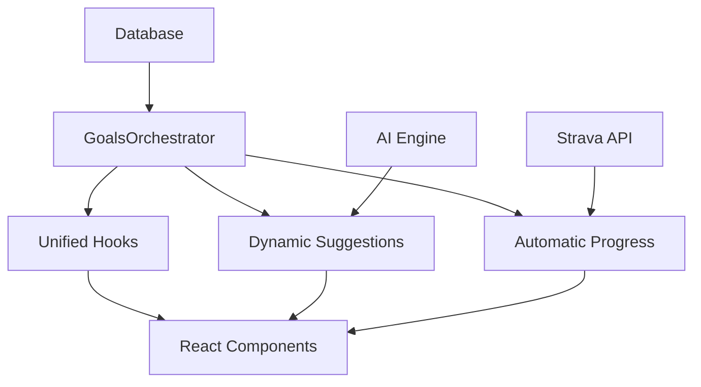

# Unified Goals Architecture

## Overview

The unified goals architecture provides a comprehensive, consistent, and well-integrated system for managing user goals across your running application. This system eliminates the previous issues of disconnected flows, data loss, and multiple UX paths.

## Architecture Components

### 🎯 Core Components



#### 1. Goals Orchestrator (`lib/goals/orchestrator.ts`)
Central service that manages all goal-related operations:
- **Goal Creation** with context tracking
- **Goal Updates** with audit trails  
- **Dashboard Management** with validation
- **Analytics & Insights** generation
- **Bulk Operations** for efficiency
- **Recommendations** based on user data

#### 2. Unified Hooks (`hooks/useGoalsOrchestrator.ts`)
React Query-powered hooks that provide:
- **Type-safe** goal operations
- **Optimistic updates** for better UX
- **Automatic cache invalidation**
- **Loading states** and error handling
- **Analytics** and recommendations

#### 3. Enhanced Components
- **AddGoalModal**: Supports both manual and suggestion-based creation
- **DynamicGoalSuggestions**: AI-powered recommendations with direct creation
- **DashboardGoalSelector**: Unified dashboard management
- **KeyMetrics**: Streamlined dashboard goal display

## Key Features Fixed

### ✅ Dynamic Suggestions Flow
**Before**: Clicking "Create Goal" from suggestions opened generic modal, losing suggestion data

**After**: Rich suggestion data flows directly into goal creation with:
- Pre-populated target values and strategies
- Difficulty mapping (conservative → beginner, etc.)
- Success probability and commitment level tracking
- AI reasoning preserved in goal notes

### ✅ Unified Goal Creation
**Before**: 4 different creation interfaces (manual, suggestions, onboarding, dashboard)

**After**: Single unified system that handles all contexts:
```typescript
// Example: Create goal from AI suggestion
await orchestrator.createGoalFromSuggestion(suggestion, {
  // Optional customizations
  target_value: 35, // Override suggested 30
  notes: "Personal modification"
});

// Example: Create goal with context
await orchestrator.createGoal(goalData, {
  type: 'onboarding',
  source: 'goal_selection_step',
  metadata: { dashboard_priority: 1 }
});
```

### ✅ Goal Data Consistency
**Before**: Inconsistent goal_data usage across components

**After**: Standardized goal_data with:
- **Creation context** tracking (manual, suggestion, onboarding, dashboard)
- **Update audit** trails with timestamps and reasons
- **Suggestion metadata** preserved for analytics
- **Dashboard settings** consistently managed

### ✅ Dashboard Goal Management  
**Before**: Separate flows for dashboard vs regular goals

**After**: Unified management with:
- Maximum 3 dashboard goals validation
- Priority ordering (1, 2, 3)
- Bulk operations for efficiency
- Consistent state management

## Usage Guide

### Basic Goal Creation

```typescript
import { useGoalsOrchestrator } from '@/hooks/useGoalsOrchestrator';

function MyComponent() {
  const { createGoal, isCreating } = useGoalsOrchestrator();
  
  const handleCreateGoal = async () => {
    await createGoal({
      goalData: {
        goal_type_id: 'weekly_distance',
        target_value: 50,
        target_unit: 'km',
        goal_data: { notes: 'Build endurance' }
      },
      context: {
        type: 'manual',
        source: 'goals_page'
      }
    });
  };
  
  return (
    <Button onClick={handleCreateGoal} disabled={isCreating}>
      {isCreating ? 'Creating...' : 'Create Goal'}
    </Button>
  );
}
```

### AI Suggestion Integration

```typescript
import { useGoalsOrchestrator } from '@/hooks/useGoalsOrchestrator';

function SuggestionCard({ suggestion }: { suggestion: DynamicGoalSuggestion }) {
  const { createGoalFromSuggestion } = useGoalsOrchestrator();
  
  const handleCreateFromSuggestion = async () => {
    await createGoalFromSuggestion({
      suggestion,
      customizations: {
        // User can override suggestion values
        target_value: suggestion.suggestedTarget + 5,
        goal_data: {
          notes: `${suggestion.reasoning}\n\nMy notes: Pushing a bit harder!`
        }
      }
    });
  };
  
  return (
    <Card>
      <h3>{suggestion.title}</h3>
      <p>{suggestion.description}</p>
      <Button onClick={handleCreateFromSuggestion}>
        Create This Goal
      </Button>
    </Card>
  );
}
```

### Dashboard Management

```typescript
import { useGoalsOrchestrator } from '@/hooks/useGoalsOrchestrator';

function DashboardManager() {
  const { manageDashboardGoals, isManaging } = useGoalsOrchestrator();
  
  const handleUpdateDashboard = async (goalIds: string[]) => {
    if (goalIds.length > 3) {
      alert('Maximum 3 dashboard goals allowed');
      return;
    }
    
    await manageDashboardGoals(goalIds);
  };
  
  // Component implementation...
}
```

### Analytics & Insights

```typescript
import { useGoalAnalytics, useGoalRecommendations } from '@/hooks/useGoalsOrchestrator';

function GoalsDashboard() {
  const { analytics, isLoading } = useGoalAnalytics();
  const { recommendations } = useGoalRecommendations();
  
  if (isLoading) return <Spinner />;
  
  return (
    <div>
      <h2>Goal Analytics</h2>
      <div className="grid grid-cols-4 gap-4">
        <Metric label="Total Goals" value={analytics?.totalGoals} />
        <Metric label="Active Goals" value={analytics?.activeGoals} />
        <Metric label="Completion Rate" value={`${analytics?.completionRate}%`} />
        <Metric label="Avg Progress" value={`${analytics?.averageProgress}%`} />
      </div>
      
      <h2>Recommendations</h2>
      {recommendations?.map(rec => (
        <RecommendationCard key={rec.id} recommendation={rec} />
      ))}
    </div>
  );
}
```

## Data Structure

### Enhanced Goal Data

```typescript
interface GoalData {
  // Basic fields
  notes?: string;
  
  // Dashboard display
  show_on_dashboard?: boolean;
  dashboard_priority?: number; // 1, 2, or 3
  
  // Context tracking
  creation_context?: 'manual' | 'suggestion' | 'onboarding' | 'dashboard';
  creation_source?: string;
  creation_metadata?: Record<string, any>;
  
  // AI Suggestion data (when applicable)
  from_suggestion?: boolean;
  suggestion_id?: string;
  suggestion_title?: string;
  suggestion_reasoning?: string;
  suggestion_strategies?: string[];
  suggestion_benefits?: string[];
  success_probability?: number;
  required_commitment?: 'low' | 'medium' | 'high';
  warnings?: string[];
  
  // Audit trail
  last_updated?: string;
  last_update_context?: string;
  last_update_reason?: string;
  
  // Additional metadata
  difficulty_level?: 'beginner' | 'intermediate' | 'advanced';
  estimated_weeks?: number;
}
```

### Goal Analytics

```typescript
interface GoalAnalytics {
  totalGoals: number;
  activeGoals: number;
  completedGoals: number;
  dashboardGoals: number;
  goalsByCategory: Record<string, number>; // distance: 3, pace: 2, etc.
  goalsByContext: Record<string, number>;  // manual: 5, suggestion: 3, etc.
  suggestionGoals: number;
  autoTrackingGoals: number;
  averageProgress: number; // 0-100
  completionRate: number;  // 0-100
}
```

## Migration Guide

### From Old System

If you have existing goals-related code, here's how to migrate:

#### Old Goal Creation
```typescript
// Old way - multiple different patterns
const createGoalMutation = useCreateGoal();
await createGoalMutation.mutateAsync(goalData);
```

#### New Goal Creation  
```typescript
// New way - unified with context
const { createGoal } = useGoalsOrchestrator();
await createGoal({ goalData, context: { type: 'manual' } });
```

#### Old Dashboard Management
```typescript
// Old way - manual updates to individual goals
for (const goal of goals) {
  await updateGoal(goal.id, { 
    goal_data: { show_on_dashboard: true } 
  });
}
```

#### New Dashboard Management
```typescript
// New way - atomic operation with validation
const { manageDashboardGoals } = useGoalsOrchestrator();
await manageDashboardGoals(['goal1', 'goal2', 'goal3']);
```

## Best Practices

### 1. Always Use Context
When creating goals, always specify the context:
```typescript
await createGoal({
  goalData,
  context: {
    type: 'manual',        // How was this goal created?
    source: 'goals_page',  // Where in the app?
    metadata: { userId }   // Any additional context
  }
});
```

### 2. Leverage Analytics
Use analytics to make data-driven decisions:
```typescript
const { analytics } = useGoalAnalytics();

// Example: Suggest dashboard setup if user has 0 dashboard goals
if (analytics?.dashboardGoals === 0) {
  showDashboardSetupPrompt();
}

// Example: Alert if completion rate is low
if (analytics?.completionRate < 30) {
  suggestGoalReview();
}
```

### 3. Handle AI Suggestions Properly
Always preserve suggestion context:
```typescript
// Good: Preserves all suggestion data
await createGoalFromSuggestion(suggestion);

// Also good: Preserves data with customizations  
await createGoalFromSuggestion(suggestion, {
  target_value: customValue,
  goal_data: { notes: userNotes }
});
```

### 4. Use Bulk Operations
For efficiency, use bulk operations when updating multiple goals:
```typescript
const updates = goals.map(goal => ({
  goalId: goal.id,
  updates: { is_active: false }
}));

await bulkUpdateGoals({ 
  updates, 
  context: { updateType: 'completion', reason: 'bulk_deactivation' }
});
```

## Testing

The unified system includes comprehensive tests:

- **Unit tests** for GoalsOrchestrator service
- **Hook tests** for React Query integration  
- **Component tests** for UI interactions
- **Integration tests** for end-to-end flows

Run tests with:
```bash
npm test goals
```

## Performance Considerations

### Caching Strategy
- Analytics data cached for 5 minutes
- Recommendations cached for 10 minutes  
- Goal data invalidated on any mutation
- Optimistic updates for better UX

### Query Optimization
- Parallel queries for analytics and recommendations
- Selective invalidation to minimize re-fetches
- Background refetching for stale data

## Troubleshooting

### Common Issues

**Q: Goals not appearing on dashboard**
A: Check that `show_on_dashboard: true` and `dashboard_priority` is set (1-3)

**Q: Suggestion data lost when creating goal**
A: Use `createGoalFromSuggestion()` instead of generic `createGoal()`

**Q: Analytics not updating**
A: Analytics cache for 5 minutes; use `refreshAnalytics()` to force update

**Q: Too many dashboard goals error**
A: Maximum 3 dashboard goals enforced; remove existing ones first

### Debug Tools

```typescript
// Get detailed goal insights
const insights = await GoalsOrchestrator.getGoalInsights('goal-id');
console.log(insights);

// Validate goal data before creation
const validation = GoalsOrchestrator.validateGoalData(goalData);
if (!validation.isValid) {
  console.error('Validation errors:', validation.errors);
}

// Check goal context and metadata
console.log('Goal context:', goal.goal_data?.creation_context);
console.log('Suggestion metadata:', goal.goal_data?.suggestion_id);
```

## Future Enhancements

The unified architecture is designed to support future enhancements:

- **Advanced Analytics**: More detailed insights and trends
- **Goal Templates**: Pre-configured goal sets for different user types
- **Social Features**: Goal sharing and challenges
- **ML Improvements**: Better suggestion algorithms
- **Mobile Optimization**: Offline-first goal management

## Support

For questions about the unified goals system:
1. Check this documentation first
2. Review the test files for usage examples
3. Look at existing component implementations
4. Create an issue if you find bugs or have suggestions

---

*This unified architecture ensures consistent, reliable, and user-friendly goal management across your entire application.* 