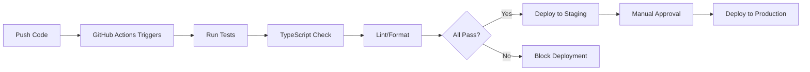

# CI/CD Overview: GitHub Actions for Next.js Development

## 🚨 **UPDATED: Strict Quality Gates Now Enforced**

**As of [Current Date]**: The CI pipeline now enforces **mandatory quality gates**. All checks must pass before code can be merged.

### **What Changed:**
- ❌ **TypeScript compilation errors**: Pipeline fails immediately
- ❌ **Linting errors**: Must be fixed before merge
- ❌ **Test failures**: All tests must pass
- ❌ **Build failures**: Code must build successfully
- ⚠️ **Security audit**: Warnings only (doesn't block merge)

### **Local Development Commands:**
```bash
# Run all quality checks locally (same as CI)
npm run ci

# Individual checks:
npm run type-check    # TypeScript compilation
npm run lint          # ESLint checks  
npm run lint:fix      # Auto-fix linting issues
npm run test:coverage # Run tests with coverage
npm run build         # Verify build works
```

### **If Your PR Fails CI:**
1. **Check the failed step** in GitHub Actions logs
2. **Run the same command locally** to reproduce the issue
3. **Fix the issue** and commit the fix
4. **Push the fix** - CI will re-run automatically

---

## What is CI/CD?

**CI/CD** stands for **Continuous Integration** and **Continuous Deployment/Delivery**:

### Continuous Integration (CI)

- **Automated testing** every time code is pushed to your repository
- **Build verification** to ensure your app compiles successfully
- **Code quality checks** (linting, formatting, security scans)
- **Integration testing** to catch conflicts when multiple developers work on the same codebase
- **Fast feedback** - you know within minutes if your changes broke something

### Continuous Deployment/Delivery (CD)

- **Continuous Delivery**: Automatically prepares your code for release (builds, tests, stages)
- **Continuous Deployment**: Automatically deploys passing code to production
- **Environment management** (dev → staging → production)
- **Rollback capabilities** if something goes wrong

## How GitHub Actions Helps

GitHub Actions is GitHub's built-in CI/CD platform that runs **workflows** based on events in your repository:

### Key Benefits for Your Next.js App:

#### 1. Automated Testing Pipeline

```yaml
# Runs your Jest + React Testing Library tests
- Run unit tests on every PR
- Run integration tests
- Generate test coverage reports
```

#### 2. Build Verification

```yaml
# Ensures your Next.js app builds successfully
- TypeScript compilation
- Build optimization
- Bundle size analysis
```

#### 3. Code Quality Gates

```yaml
# Maintains code standards
- ESLint checks
- Prettier formatting
- TypeScript type checking
```

#### 4. Deployment Automation

```yaml
# Deploys to Vercel/Netlify when tests pass
- Automatic preview deployments for PRs
- Production deployment on main branch
```

## Typical Workflow for Your Project



**Step-by-step flow:**

1. You push code
2. GitHub Actions triggers
3. Runs tests (Jest + RTL)
4. Checks TypeScript compilation
5. Runs linting/formatting
6. If all pass: deploys to staging
7. Manual approval for production
8. Deploys to production

## Benefits for Your Development Process

### 🚀 Quality Assurance
- **Catch bugs early** - Tests run automatically before code reaches production
- **Consistent quality** - Same checks run for every developer
- **Safe deployments** - Only tested, passing code gets deployed

### 👥 Team Collaboration
- **Team confidence** - Everyone knows the build is healthy
- **Standardized process** - Same workflow for all contributors
- **Code review integration** - PR status checks

### ⏰ Time Savings
- **Automated workflows** - No manual testing/deployment steps
- **Parallel execution** - Multiple checks run simultaneously
- **Fast feedback loops** - Know immediately if something breaks

## Security for Your Strava App

### 🔐 Environment Management
```yaml
env:
  STRAVA_CLIENT_ID: ${{ secrets.STRAVA_CLIENT_ID }}
  STRAVA_CLIENT_SECRET: ${{ secrets.STRAVA_CLIENT_SECRET }}
  DATABASE_URL: ${{ secrets.DATABASE_URL }}
```

### 🛡️ Security Checks
- **Environment secrets** - Store API keys, tokens securely
- **Token refresh testing** - Verify OAuth flows work correctly
- **Security scanning** - Check for vulnerable dependencies
- **Dependency updates** - Automated security patches

## Example GitHub Actions Workflow

```yaml
name: CI/CD Pipeline

on:
  push:
    branches: [main, develop]
  pull_request:
    branches: [main]

jobs:
  test:
    runs-on: ubuntu-latest
    steps:
      - uses: actions/checkout@v4
      - uses: actions/setup-node@v4
        with:
          node-version: '18'
          cache: 'npm'
      
      - name: Install dependencies
        run: npm ci
      
      - name: Run tests
        run: npm run test:ci
      
      - name: TypeScript check
        run: npm run type-check
      
      - name: Lint code
        run: npm run lint
      
      - name: Build application
        run: npm run build

  deploy:
    needs: test
    runs-on: ubuntu-latest
    if: github.ref == 'refs/heads/main'
    steps:
      - name: Deploy to Vercel
        uses: amondnet/vercel-action@v25
        with:
          vercel-token: ${{ secrets.VERCEL_TOKEN }}
          vercel-org-id: ${{ secrets.ORG_ID }}
          vercel-project-id: ${{ secrets.PROJECT_ID }}
```

## Best Practices

### ✅ Testing Strategy
- **Unit tests** for individual components and hooks
- **Integration tests** for API interactions
- **E2E tests** for critical user flows
- **Coverage thresholds** to maintain quality

### 🔄 Branching Strategy
- **Feature branches** → Pull Requests → Main
- **Protection rules** on main branch
- **Required status checks** before merging
- **Automatic deployments** from main

### 📊 Monitoring
- **Build status badges** in README
- **Deployment notifications** in Slack/Discord
- **Performance monitoring** on production
- **Error tracking** with Sentry/similar

---

*This overview covers the essential concepts of CI/CD and how GitHub Actions can streamline your Next.js development workflow while maintaining high code quality and secure deployments.* 