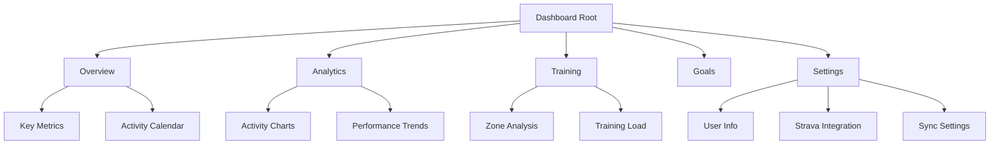

# Implementing a Professional Dashboard Sidebar with shadcn/ui

## Overview

This document covers the complete implementation of a professional dashboard sidebar using shadcn/ui components, including the challenges we faced with Next.js App Router server/client component separation and how we resolved them.

## Table of Contents

1. [Initial Dashboard State](#initial-dashboard-state)
2. [UX Planning and Architecture](#ux-planning-and-architecture)
3. [Sidebar Implementation](#sidebar-implementation)
4. [Server/Client Component Issues](#serverclient-component-issues)
5. [Solutions and Fixes](#solutions-and-fixes)
6. [Final Architecture](#final-architecture)
7. [Lessons Learned](#lessons-learned)

## Initial Dashboard State

### The Problem

Our initial dashboard was a single page (`/dashboard`) containing all functionality:

- Key metrics
- Activity charts
- Activity contribution calendar
- User information
- Strava integration
- Sync dashboard
- Zone analysis

This created several issues:

- **Cluttered UI** - Too much information on one page
- **Poor UX** - No clear navigation structure
- **Scalability concerns** - Adding new features would make it worse
- **Mobile unfriendly** - No responsive navigation

### Code Structure Before

```tsx
// app/dashboard/page.tsx - Everything in one file!
export default async function DashboardPage() {
  return (
    <div className="min-h-screen bg-gray-50">
      {/* Key Metrics */}
      <KeyMetrics userId={user.id} />

      {/* Activity Charts */}
      <ActivityCharts userId={user.id} />

      {/* User Information */}
      <UserInfoSection />

      {/* Strava Integration */}
      <StravaIntegration />

      {/* Sync Dashboard */}
      <SyncDashboard />

      {/* Zone Analysis */}
      <ZoneAnalysisDashboard />
    </div>
  );
}
```

## UX Planning and Architecture

### Design Decisions

We decided on a **sidebar navigation pattern** for several reasons:

#### Why Sidebar Over Top Navigation?

- ✅ **More space** for content on each page
- ✅ **Better mobile experience** (collapsible)
- ✅ **Scales well** as we add features
- ✅ **Industry standard** for dashboard applications
- ✅ **Clear separation** of concerns

#### Proposed Page Structure

```
📊 Dashboard (Overview)    - Key metrics + activity calendar
📈 Analytics              - Detailed charts and insights
🏋️ Training Load          - Zone analysis + training metrics
🎯 Goals                  - Goal setting and tracking (future)
📅 Calendar               - Training calendar (future)
⚙️ Settings               - User info, integrations, sync
```

#### Information Architecture



## Sidebar Implementation

### Step 1: Installing shadcn/ui Sidebar

```bash
npx shadcn@latest add sidebar
```

This installed:

- `components/ui/sidebar.tsx`
- `components/ui/sheet.tsx`
- `hooks/use-mobile.ts`
- `components/ui/skeleton.tsx`

### Step 2: Creating the Dashboard Layout

```tsx
// components/dashboard/DashboardLayout.tsx
'use client';

import { ReactNode } from 'react';
import { User as SupabaseUser } from '@supabase/supabase-js';
import {
  Sidebar,
  SidebarContent,
  SidebarFooter,
  SidebarGroup,
  SidebarGroupContent,
  SidebarGroupLabel,
  SidebarHeader,
  SidebarMenu,
  SidebarMenuButton,
  SidebarMenuItem,
  SidebarProvider,
  SidebarRail,
  SidebarTrigger,
} from '@/components/ui/sidebar';

interface DashboardLayoutProps {
  children: ReactNode;
  user: SupabaseUser;
}

const navigation = [
  {
    title: 'Overview',
    items: [
      {
        title: 'Dashboard',
        url: '/dashboard',
        icon: Home,
        description: 'Overview and key metrics',
      },
    ],
  },
  {
    title: 'Analytics',
    items: [
      {
        title: 'Activity Analysis',
        url: '/dashboard/analytics',
        icon: BarChart3,
        description: 'Detailed activity charts and insights',
      },
      // ... more items
    ],
  },
  // ... more groups
];

export function DashboardLayout({ children, user }: DashboardLayoutProps) {
  return (
    <SidebarProvider>
      <div className="flex min-h-screen w-full">
        <AppSidebar user={user} />
        <main className="flex-1">
          <header className="flex h-16 shrink-0 items-center gap-2 border-b px-4">
            <SidebarTrigger className="-ml-1" />
          </header>
          <div className="flex-1 space-y-4 p-4 md:p-6 lg:p-8">{children}</div>
        </main>
      </div>
    </SidebarProvider>
  );
}
```

### Step 3: Navigation Structure

The sidebar includes:

- **Header** - App branding and logo
- **Navigation Groups** - Organized by functionality
- **Active State** - Highlights current page
- **Footer** - User dropdown with profile/logout
- **Mobile Responsive** - Collapsible trigger

## Server/Client Component Issues

### The Problem Discovered

When we restructured the dashboard, we encountered a critical issue:

```tsx
// This doesn't work in Next.js App Router!
export default async function DashboardPage() {
  const user = await requireAuth(); // Server component

  return (
    <DashboardLayout user={user}>
      {/* This component uses React Query hooks */}
      <KeyMetrics userId={user.id} />
    </DashboardLayout>
  );
}
```

#### Error Messages We Encountered:

- "You're importing a component that needs useQuery. This only works in a Client Component"
- "Cannot use hooks in Server Components"
- Hydration mismatches between server and client rendering

#### Root Cause Analysis:

1. **Server Components** (Next.js App Router default):
   - Run on the server during build/request time
   - Cannot use React hooks like `useState`, `useQuery`
   - Cannot access browser APIs
   - Good for initial data fetching and SEO

2. **Client Components** (marked with `'use client'`):
   - Run in the browser
   - Can use React hooks and browser APIs
   - Required for interactive components
   - Bundle size impact on client

3. **Our Components Were Mixed**:

   ```tsx
   // Server component (good)
   export default async function DashboardPage() {
     const user = await requireAuth();
     // ...
   }

   // Client component trying to be used in server context (bad!)
   export function KeyMetrics({ userId }: { userId: string }) {
     const { data } = useUserActivities(userId); // Hook usage!
     // ...
   }
   ```

## Solutions and Fixes

### Solution 1: Client Component Wrappers

We created dedicated client wrapper components that handle data fetching:

```tsx
// components/dashboard/ActivityChartsClient.tsx
'use client';

import { useUserActivities } from '@/hooks/use-user-activities';
import { ActivityCharts } from './ActivityCharts';

export function ActivityChartsClient({ userId }: { userId: string }) {
  const { data: activities, isLoading, error } = useUserActivities(userId);

  if (isLoading) return <LoadingSkeleton />;
  if (error) return <ErrorState />;

  return <ActivityCharts activities={activities || []} />;
}
```

### Solution 2: Pure Presentation Components

We refactored our components to separate data fetching from presentation:

```tsx
// Before: Mixed concerns (bad)
export function ActivityCharts({ userId }: { userId: string }) {
  const { data: activities, isLoading, error } = useUserActivities(userId);

  // Presentation logic mixed with data fetching
  return <div>{/* Charts using activities */}</div>;
}

// After: Pure presentation (good)
export function ActivityCharts({ activities }: { activities: Activity[] }) {
  // Only presentation logic, no data fetching
  return <div>{/* Charts using activities prop */}</div>;
}
```

### Solution 3: Proper Component Architecture

```tsx
// Server Component (page level)
export default async function AnalyticsPage() {
  const user = await requireAuth(); // Server-side auth

  return (
    <DashboardLayout user={user}>
      <Suspense fallback={<LoadingSkeleton />}>
        {/* Client component handles data fetching */}
        <ActivityChartsClient userId={user.id} />
      </Suspense>
    </DashboardLayout>
  );
}
```

### Solution 4: Type Safety Improvements

We fixed TypeScript issues with user types:

```tsx
// Before: Custom interface (problematic)
interface DashboardLayoutProps {
  user: {
    email: string;
    id: string;
  };
}

// After: Using Supabase types (correct)
import { User as SupabaseUser } from '@supabase/supabase-js';

interface DashboardLayoutProps {
  user: SupabaseUser;
}
```

## Final Architecture

### File Structure

```
app/
├── dashboard/
│   ├── page.tsx              # Server component (overview)
│   ├── analytics/
│   │   └── page.tsx          # Server component (analytics)
│   ├── training/
│   │   └── page.tsx          # Server component (training)
│   └── settings/
│       └── page.tsx          # Server component (settings)
├── components/
│   ├── dashboard/
│   │   ├── DashboardLayout.tsx           # Client layout component
│   │   ├── ActivityCharts.tsx            # Pure presentation
│   │   ├── ActivityChartsClient.tsx      # Client data wrapper
│   │   ├── ActivityContributionCalendar.tsx  # Pure presentation
│   │   └── ActivityContributionCalendarClient.tsx  # Client data wrapper
```

### Component Responsibilities

#### Server Components (Pages):

- ✅ Authentication checks
- ✅ Layout rendering
- ✅ Static content
- ✅ SEO optimization

#### Client Wrapper Components:

- ✅ Data fetching with React Query
- ✅ Loading states
- ✅ Error handling
- ✅ Hook usage

#### Presentation Components:

- ✅ Pure UI rendering
- ✅ Props-based data
- ✅ Reusable across contexts
- ✅ Easy to test

### Data Flow

```
Server Page → Client Wrapper → Presentation Component
     ↓              ↓                ↓
  Auth Check    Data Fetch      Pure Render
  User Info     Loading State   Charts/UI
  Layout        Error Handle    Interactions
```

## Lessons Learned

### 1. Next.js App Router Best Practices

**Server Components by Default**:

- Use server components for pages and layouts
- Keep data fetching on the server when possible
- Use client components only when necessary

**Client Components When Needed**:

- Interactive components requiring hooks
- Browser API usage
- State management
- Real-time updates

### 2. Component Architecture Patterns

**Separation of Concerns**:

```tsx
// ✅ Good: Separated responsibilities
<ServerPage>           {/* Auth, layout, static content */}
  <ClientWrapper>      {/* Data fetching, loading states */}
    <PresentationComponent />  {/* Pure UI rendering */}
  </ClientWrapper>
</ServerPage>

// ❌ Bad: Mixed responsibilities
<ComponentThatDoesEverything />  {/* Auth + data + UI + state */}
```

**Prop Drilling vs Context**:

- Use props for simple data passing
- Use context for deeply nested shared state
- Avoid prop drilling through many levels

### 3. TypeScript Integration

**Use Framework Types**:

```tsx
// ✅ Good: Use Supabase/framework types
import { User } from '@supabase/supabase-js';

// ❌ Bad: Custom interfaces that duplicate framework types
interface CustomUser {
  id: string;
  email: string;
}
```

**Proper Prop Types**:

```tsx
// ✅ Good: Clear, specific prop types
interface ActivityChartsProps {
  activities: Activity[];
}

// ❌ Bad: Vague or overly complex types
interface Props {
  data?: any;
  config?: object;
}
```

### 4. Error Handling Strategies

**Graceful Degradation**:

```tsx
export function ClientWrapper({ userId }: { userId: string }) {
  const { data, isLoading, error } = useQuery(...)

  if (isLoading) return <Skeleton />     // Show loading state
  if (error) return <ErrorBoundary />    // Show error state
  if (!data) return <EmptyState />       // Show empty state

  return <Component data={data} />       // Show success state
}
```

### 5. Performance Considerations

**Bundle Size Optimization**:

- Keep client components small and focused
- Use dynamic imports for heavy components
- Leverage React.lazy for code splitting

**Caching Strategies**:

- Use React Query for client-side caching
- Implement proper stale-while-revalidate patterns
- Consider server-side caching for expensive operations

## Conclusion

Implementing a professional sidebar with Next.js App Router required careful consideration of:

1. **UX Design** - Logical information architecture
2. **Component Architecture** - Server/client separation
3. **Data Flow** - Clear data fetching patterns
4. **Type Safety** - Proper TypeScript integration
5. **Performance** - Optimized bundle sizes and caching

The final result is a scalable, maintainable dashboard architecture that provides:

- ✅ Professional user experience
- ✅ Clear navigation structure
- ✅ Responsive design
- ✅ Type-safe implementation
- ✅ Optimized performance
- ✅ Easy feature additions

This foundation allows for easy addition of new features while maintaining code quality and user experience standards.
